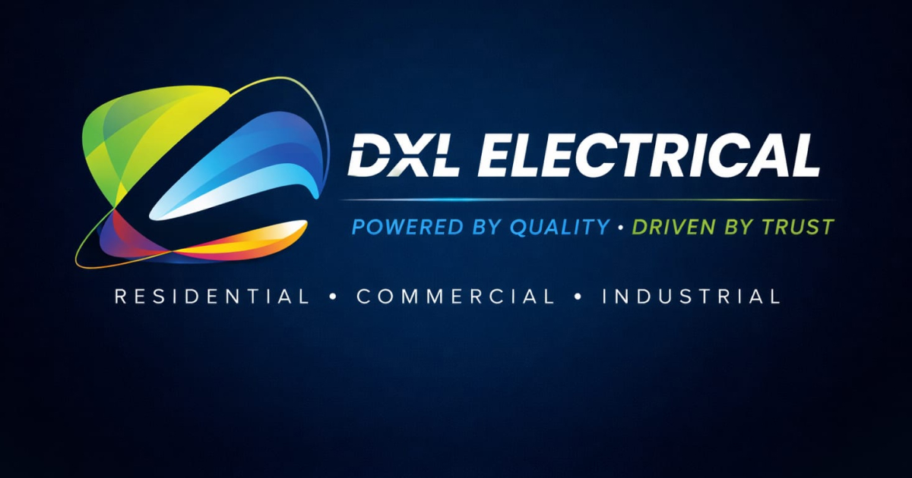

# DXL Electrical Website

A modern, responsive website developed for **DXL Electrical**, an electrical contractor serving the Garden Route, South Africa.



---

## About

This website was designed and developed to showcase DXL Electrical's residential, commercial and industrial electrical services while providing a fast, SEO-friendly and mobile-first experience.

## Features

- Responsive mobile-first design
- SEO optimised
- Fast loading performance
- Accessible HTML5 structure
- Service modal system
- Portfolio filtering
- Contact CTAs
- WhatsApp integration
- Smooth scrolling navigation
- Optimised WebP imagery
- Social sharing support (Open Graph)

---

## Technology

- HTML5
- CSS3
- JavaScript (Vanilla)
- Bootstrap Icons
- AOS (Animate On Scroll)

---

## Folder Structure

```
assets/
│
├── css/
├── js/
├── img/
├── vendor/
│
index.html
README.md
```

---

## Optimisations

- Semantic HTML
- Lazy loaded images
- Optimised WebP assets
- Open Graph metadata
- Apple Touch Icon
- Favicon support
- Mobile-first CSS architecture

---

## Browser Support

- Chrome
- Edge
- Firefox
- Safari
- Mobile Chrome
- Mobile Safari

---

## Contact

**DXL Electrical**

📞 071 863 2106

📧 info@dxlelectrical.co.za

🌍 Garden Route, South Africa

---

## License

This project was developed exclusively for DXL Electrical.

© 2026 DXL Electrical. All Rights Reserved.
